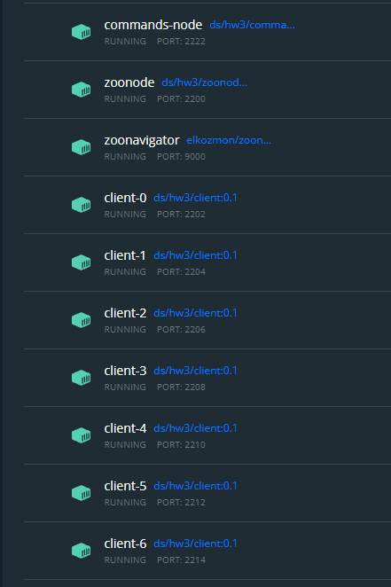
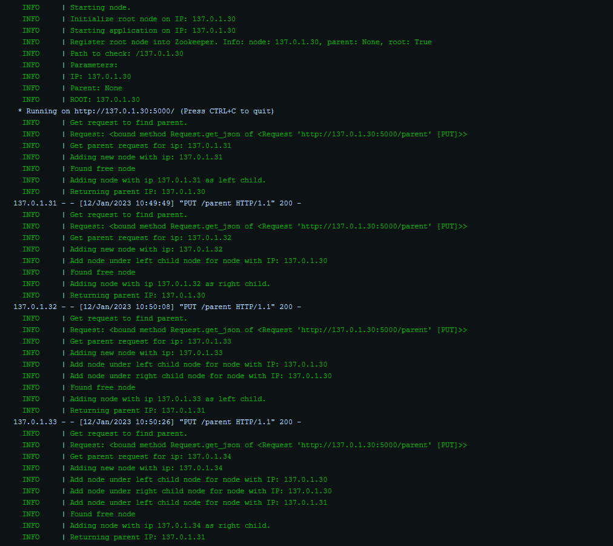
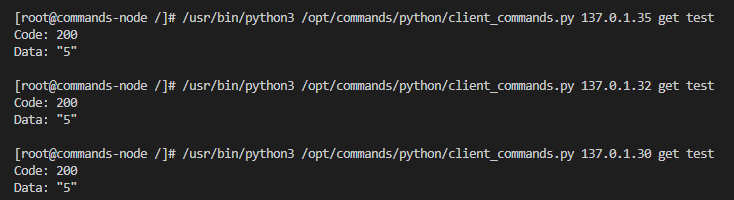
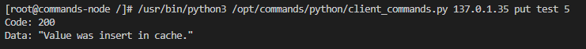
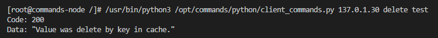
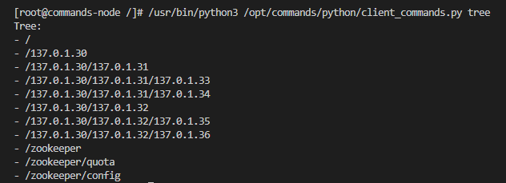
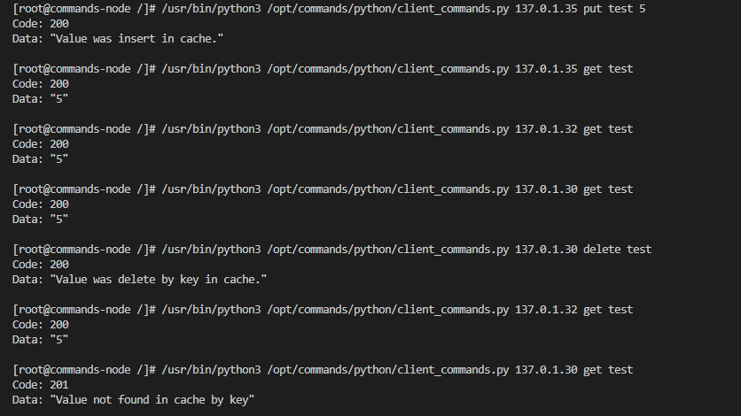
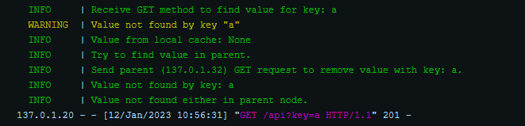
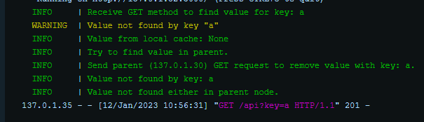
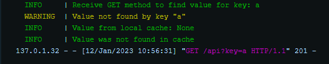

# Distribuováná cache
Cílem je navhnout a implementovat distribuovanou cache se stromovou strukturou. Bude se jednat o binární strom, kde maximální počet úrovní bude 3 nebo 4. Počet úrovní je volitelný pomocí konfiguračního parametru. Pokud bude zadána jiná hodnota bude nastavena na výchozí hodnotu 3. Dále je možné v konfiguraci identifikace (IP adresa nebo jméno) kořenového uzlu. Hierarchická struktura cache bude evidována jako odpovídající model v Apache Zookeeper.

## API rozhraní
Jednotlivé uzle spolu budou komunikovat pomocí následujícího API rozhraní:
* GET - Metoda vrátí hodnotu nalezenou v lokální cache daného uzlu. Pokud není hodnota nalezena uzel se pokusí získat hodnotu z rodičovského uzlu, který bude mít stejné chování a nejprve se podívá do lokální cache a při nenalezení hodnoty se zeptá rodičovského uzlu. Pokud se najde hodnota v některém z rodičovských uzlů, pak se tato hodnota propíše do všech potomků.Pokud se hodnota rekurzivně nenalezne ani v kořenovém uzlu vrátí hodnota None s příslušným návratovým kódem.

* PUT - Metoda vloži do lokální cache záznam klíč-hodnota a následně pošle stejný požadavek na rodičovský uzel. Takto se tento záznam propíše až do kořenového uzlu.

* DELETE - Metoda odstraní záznam v lokální cache podle zadaného klíče. Následně je tento požadavek poslán na rodičovský uzel. Takto se tato změna propíše až do kořenového uzlu.

## Konfigurace
Konfiguraci je možné změnit v souboru Vagranfile.
### Síť

### Úroveň stromu
Úroveň stromu je možné nastavit změnou hodnoty `TREE_LEVELS`
```
TREE_LEVELS = 3     # 3 or 4
```

### Počet uzlů stromové struktury
Počet uzlů se vypočítá následovně: `2^TREE_LEVEL - 1`
4 úrovně stromu: 15 uzlů
3 úrovně stromu: 7 uzlů

### Kořenový uzel
Index kořenového uzlu je možné nastavit v proměnné `ROOT_NODE_INDEX`. Hodnota se musí pohybovat v rozmezí 0 až (Počet uzlů - 1)
```
ROOT_NODE_INDEX = 0
```

## Spuštění projektu
Po naklonování Github repozitáře na lokální zařízení je možné projekt spustit v kořenovém adresáři ve složce demo-4 pomocí příkazu:
```
vagrant up
```
Tímto příkazem se vytvoří jednotlivé kontejnery pro uzly distribuované cache, zoonode, zoonavigátor a klientský program pro posílání požadavků.



## Vypnutí projektu
Jednotlivé kontejnery se ukončí a odstraní pomocí příkazu:
```
vagrant destroy -f
```

## Logy
Každý uzel loguje jednotlivé operace které následně vypisuje.



## Swagger Api
Pro jednotlivé uzlu bylo vytvořen Open API interface pro interkaci a posílání požadavků na jednotlivé uzly. je možné se každý uzel připojit na jeho IP adrese např. [http://137.0.1.30:5000](http://137.0.1.30:5000)

## Zoonavigator
Zoonavigátor slouží pro sledování struktury distribuované cache. Kontejner pro navigátor se vytvoří po spuštění projektu s názven zoonavigator. Na adrese [http://137.0.1.100:9000](http://137.0.1.100:9000). Do connection string se následně zadá adresa: 137.0.1.10:2181

## Uživatelský program
Uživatelský program se nachází v kontejneru `commands-node`. Kontejner je spuštěn na adrese [http://137.0.1.20:5000](http://137.0.1.20:5000). Pro připojení do toho kontejneru slouží příkaz:
```
docker exec -it commands-node /bin/bash
```

Program se nachází v adresáři `/opt/commands/python`. Program slouží pro interakci s distribuovanou cache obsahuje následující operace.
Každý program vrací návratový kód, popisující výsledek dané operace a příklad s výsledkem.
* get 
  * Popis: Získá hodnotu z daného uzlu nebo z některého t nadřazených rodičovských uzlů
  * Návratová hodnota: Příkaz vrací kód a v případě hodnotu, pokud v uzlu existuje záznam s daným kličem nebo zprávu o výsledku operace.
    ```
    python3 client_commands.py 137.0.1.30 get test
    ```
    Příklad:

    

* put
  * Popis: Uloží hodnotu do daného uzlu a rekurzivně do rodičovských uzlů.
  * Návratová hodnota: Zprávu o výsledku operace.
    ```
    python3 client_commands.py 137.0.1.30 delete test 5
    ```
    Příklad:
  
    
  
* delete
  * Popis: Odstraní hodnotu v daném uzlu a rekurzivně v rodičovských uzlech.
  * Návratová hodnota: Zprávu o výsledku operace.
    ```
    python3 client_commands.py 137.0.1.30 delete test
    ```
    Příklad:
  
        
  
* tree
  * Vypíše stromovou strukturu s cestami k jednotlivým uzlům
    ```
    python3 client_commands.py 137.0.1.30 tree
    ```
    Příklad:
  
    

Na následujícím obrázku vidíme že nejprve byl přidána hodnota 5 pro klíč test. Následně byla hodnota vypropagována podle
stromové struktury až do kořenového uzlu, což potvrzují požadavky na rodičovské uzle. Následně byla hodnota z kořenového
uzlu vymazána ale v uzlech potomků se tato změna neprojevila protože se aktualizují data jen směrem nahoru.



### Rekurzivně zapisování do rodičovských uzlů
Zde je ukázka jak se hodnoty propagují do rodičovských uzlů.
Požadavek byl poslán na list stromu a požadavek byl na získání hodnoty s klíčem `a`, která ve struktuře neexistuje.

List:



Rodič listu:



Kořen:



## Cache cohorence


